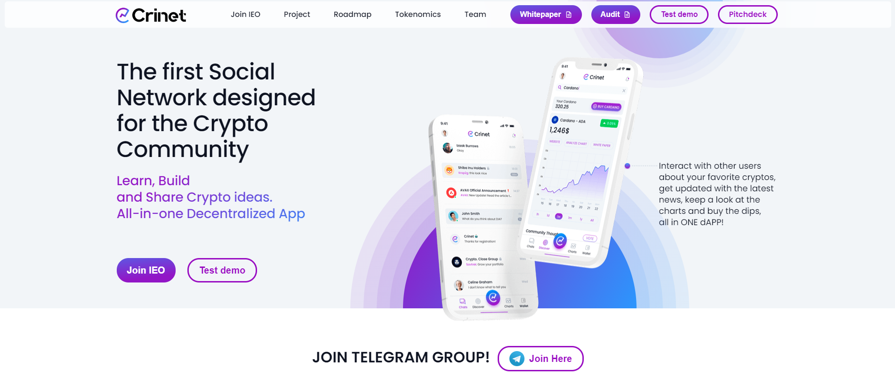
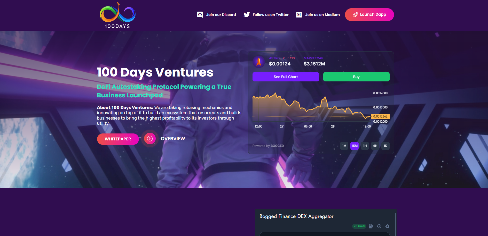
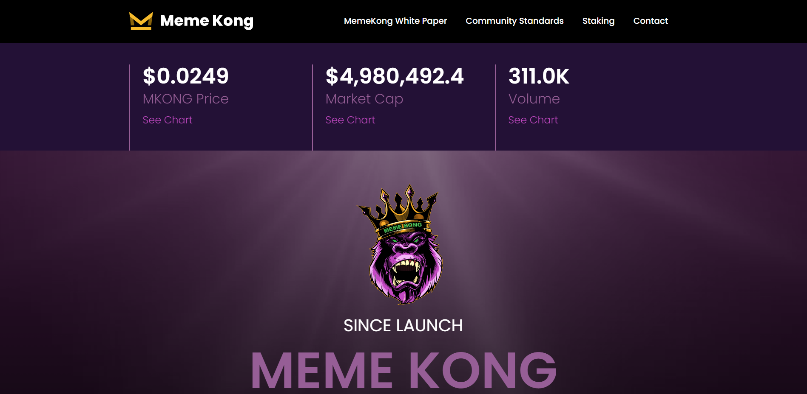
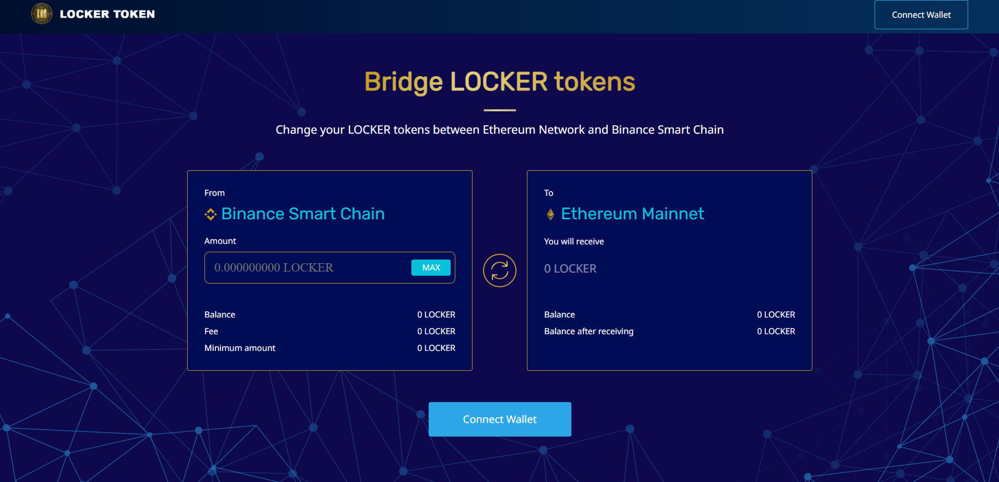
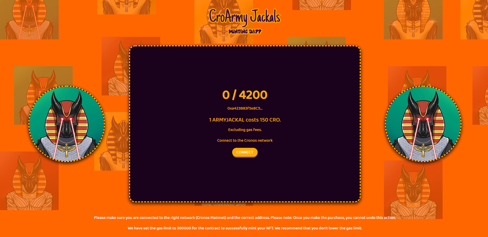
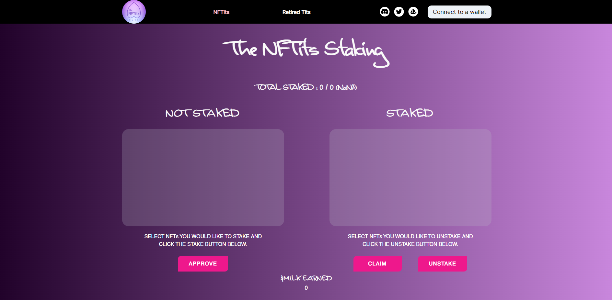

### Senior Full Stack | Blockchain Developer 👩‍💻

👋  Hello

I am a professional blockchain and full stack developer with 4 years of experience in developing blockchain applications.
I am good at creating smart contracts and has extensive experience in developing Presale, DeFi, DAO, DEX and Bridge projects in ETH, BSC, Polygon & Solana as well as developing NFT minting | staking platforms.

🏆 Here is summary of my skillset.

💠  Total Professional Experience - 8 years
 - Blockchain 		4+ years
 - Node 			8+ years
 - React			5+ years
 - Full Stack 		5+ years
 - Spring 			5+ years
 - Unity 			4 years
 - android 			8 years
 - C/C++/C#  		8+ years
 - Others

### Portfolios

- Presale
<table>
    <thead align="center">
        <tr>
            <td>Crinet</td>
            <td>ASTRO</td>
            <td>MITO</td>
        </tr>
    </thead>
    <tr>
        <td>
            
        </td>        
        <td>
            
        </td> 
        <td>
            
        </td> 
    </tr>
</table>

- Defi & DAO & BRIDGE
<table>
    <thead align="center">
        <tr>
            <td>MEME KONG</td>
            <td>Tazor</td>
            <td>LOCKER Bridge</td>
        </tr>
    </thead>
    <tr>
        <td>
            
        </td>          
        <td>
            
        </td>   
        <td>
            
        </td> 
    </tr>  
</table>

- NFT Mint Dapps
<table>
    <thead align="center">
        <tr>
            <td>Croarmy</td>
            <td>Mad Goblin</td>
            <td>NFTits</td>
        </tr>
    </thead>
    <tr>
        <td>
            
        </td>
        <td>
            
        </td>           
        <td>
            
        </td>             
    </tr>
</table>

### Programming

> Programming languages.

    
    
    
    
    
    
    
    
    
    
    
    
    

> Frameworks and libraries.

    
    
    
    
    
    
    
    
    
    
    
    
    

> Databases and cloud hosting.

    
    
    
    
    
    
    
    

